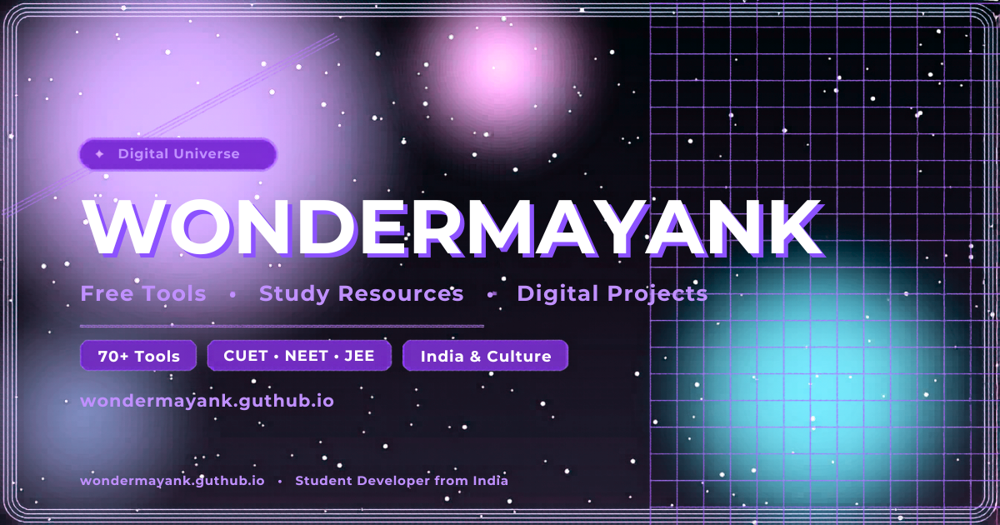

<div align="center">



# ✨ Wondermayank — Digital Universe

**Free tools, study resources & digital projects for students across India**

[](https://wondermayank.github.io/)
[](https://t.me/wondermayank)
[](https://www.youtube.com/@wondermayank)
[](https://www.instagram.com/WONDERMAYANK)

</div>

---

## 🌐 What is this?

This is the source repo for **[wondermayank.github.io](https://wondermayank.github.io/)** — a personal index page and digital hub built by Wondermayank, a student developer from India.

The site is a central launchpad for **70+ free tools, exam prep simulators, study resources, cultural projects and creative experiments** — all completely free, no sign-up required.

---

## 📁 Repo File Structure

```
wondermayank.github.io/
│
├── index.html          ← Main homepage (SEO + AEO + GEO optimised)
├── about.html          ← About page (Person schema entity page)
├── sitemap.xml         ← XML sitemap for Google Search Console
├── robots.txt          ← Crawl rules (Google, GPTBot, Claude, Perplexity)
├── llms.txt            ← AI-readable directory for LLM discovery (GEO)
├── og-cover.jpg        ← Open Graph / Twitter Card social share image
├── logo2.svg           ← Site favicon / logo
│
├── background.mp4      ← Hero video (landscape)
├── background_m.mp4    ← Hero video (portrait / mobile)
│
└── [tool folders]      ← Each tool lives in its own subfolder
    ├── movie/
    ├── anime/
    ├── books/
    ├── paletteify/
    ├── cbtmock/
    ├── pdftotext/
    ├── card/
    ├── hindi/
    ├── india/
    └── ...
```

---

## 🛠️ Creation 7 — Tool Categories

### 🔍 Finder
| Tool | Description | Link |
|------|-------------|------|
| Movie Finder | Search Indian and international movies, ratings & details | [→](https://wondermayank.github.io/movie) |
| Anime Finder | Discover anime via Jikan API with full metadata | [→](https://wondermayank.github.io/anime) |
| Book Finder | Find books by title, author or genre | [→](https://wondermayank.github.io/books) |
| Game | Free browser game for PC & mobile | [→](https://wondermayank.github.io/game) |

### 📚 Study
| Tool | Description | Link |
|------|-------------|------|
| CBT Mock Test | Exam simulator — CUET, NEET, JEE, Banking, SSC | [→](https://wondermayank.github.io/cbtmock) |
| Book Hub | Educational books and structured study resources | [→](https://wondermayank.github.io/book) |
| English Practice | Grammar, vocabulary and language tests | [→](https://wondermayank.github.io/cbtmock/english) |
| General Aptitude | Reasoning and awareness practice | [→](https://wondermayank.github.io/cbtmock/gat) |
| Current Affairs | Monthly, quarterly & yearly current affairs | [→](https://wondermayank.github.io/Current_Affairs) |
| Periodic Table | Interactive chemistry periodic table | [→](https://wondermayank.github.io/Periodic-Table/v2/) |
| Hindi Typing | Learn and practise Hindi typing | [→](https://wondermayank.github.io/hindi) |
| Study Blog | Commerce & exam prep notes on Blogger | [→](https://commercesehoga.blogspot.com) |

### ⚙️ Tools
| Tool | Description | Link |
|------|-------------|------|
| Paletteify | Free color palette generator for designers | [→](https://wondermayank.github.io/paletteify) |
| Text to PDF | Convert plain text to formatted PDF | [→](https://wondermayank.github.io/pdftotext) |
| Help Tool | Daily helpers and quick-reference utilities | [→](https://wondermayank.github.io/help) |
| Card Generator | Digital cards for weddings, birthdays & events | [→](https://wondermayank.github.io/card) |

### 🇮🇳 India & Culture
| Page | Description | Link |
|------|-------------|------|
| What is India? | History, philosophy, geography & identity | [→](https://wondermayank.github.io/india) |
| Festivals of India | Diwali, Holi, Eid, Pongal & more | [→](https://wondermayank.github.io/india/festivals) |
| Indian Cuisine | Spices, flavours & regional cuisines | [→](https://wondermayank.github.io/india/cuisine) |
| Languages of India | Sanskrit, Tamil, Hindi, Bengali & 1600+ more | [→](https://wondermayank.github.io/india/languages) |
| Indian Art & Dance | Bharatanatyam, Madhubani & living heritage | [→](https://wondermayank.github.io/india/art) |
| History of India | Indus Valley to Independence | [→](https://wondermayank.github.io/india/history) |
| Kayastha | Community history and cultural traditions | [→](https://wondermayank.github.io/kayastha) |
| Rajput | Royal heritage and valor of Rajput clans | [→](https://wondermayank.github.io/rajput) |

---

## 🎓 Exam Prep (CBT Simulators)

Free Computer-Based Test simulators hosted at [commercesehoga.github.io](https://commercesehoga.github.io/):

| Exam | Direct Link |
|------|-------------|
| CUET | [commercesehoga.github.io/dashboard](https://commercesehoga.github.io/dashboard) |
| NEET / JEE | [commercesehoga.github.io/jee-neet](https://commercesehoga.github.io/jee-neet) |
| Banking (SBI, IBPS) | [commercesehoga.github.io/banking](https://commercesehoga.github.io/banking) |
| SSC (CGL, CHSL) | [commercesehoga.github.io/ssc](https://commercesehoga.github.io/ssc) |

---

## 📡 Telegram Communities

| Channel / Group | Link |
|----------------|------|
| Wondermayank Community | [t.me/wondermayank](https://t.me/wondermayank) |
| Contact Bot | [t.me/Mindmaster_robot](https://t.me/Mindmaster_robot) |

---

## 🔍 SEO / AEO / GEO Status

This repo is fully optimised for search engines, AI answer engines and generative search:

| File | Purpose |
|------|---------|
| `index.html` | Title, meta description, canonical, OG tags, Twitter Card, H1, JSON-LD Person + WebSite + FAQPage + BreadcrumbList schemas, FAQ section, noscript crawler list |
| `about.html` | Dedicated entity page — Person schema, ProfilePage schema, tool directory |
| `sitemap.xml` | 30+ URLs with priority & changefreq — submit to Google Search Console |
| `robots.txt` | Allows all crawlers: Googlebot, GPTBot, ClaudeBot, PerplexityBot, Meta-ExternalAgent |
| `llms.txt` | AI-readable structured directory — helps ChatGPT, Claude, Gemini, Perplexity discover and cite this site |
| `og-cover.jpg` | 1200×630px social preview image for Twitter, Instagram, WhatsApp shares |

> **After pushing:** Submit `https://wondermayank.github.io/sitemap.xml` to [Google Search Console](https://search.google.com/search-console).

---

## 🚀 Tech Stack

- Pure **HTML5 + CSS3 + Vanilla JavaScript** — zero build tools, zero dependencies
- Hosted on **GitHub Pages** — free, fast, reliable
- Fonts via **Google Fonts** (Syne + DM Sans)
- Dark / Light theme toggle stored in `localStorage`
- Interactive India map via **Simplemaps SVG**
- Hero video with fallback chain (relative → remote → alt)

---

## 📄 Legal

- [Privacy Policy](https://wondermayank.github.io/privacy)
- [Terms & Conditions](https://wondermayank.github.io/terms)
- [Disclaimer](https://wondermayank.github.io/disclaimer)

---

<div align="center">

© 2018 **Wondermayank**. All rights reserved.

Made with ❤️ in India · [wondermayank.github.io](https://wondermayank.github.io/)

</div>
